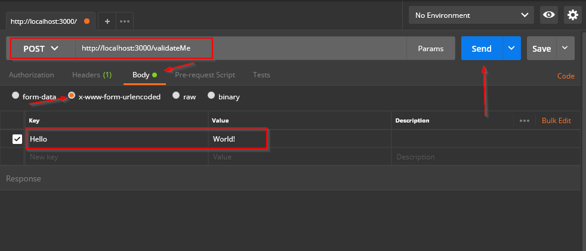

Express-validator is a great tool for validating form values or other input. In this tutorial, I will cover the following:

- Basics of express-validator 5.x
- Share tips on how to better organize the validators within your code

I thought I’d write this tutorial since quite a bit has changed from Express-validator 3.x and 99% of all tutorials out there are based on the legacy Express-validator API.

## Pre-requisites/Setup
This tutorial assumes you already have Node 6.0 or greater up and running. For simplicity, I will be using Postman to post form data rather than a webpage. If you aren’t familiar with Postman, I would highly recommend you check it out as that’s another value tool to use for testing things like form validation and a lot more.

### 1: Install Postman
Go to https://www.getpostman.com/apps, download the Postman app, and install it.

Please note that Postman also has a Chrome app, but Chrome apps are being phased out of Chrome, so get the desktop app directly from their website.

### 2: Install Required Packages
Run the following command to start an npm project in your folder of choice.
```shell
npm init
```

Run the following command to install Express, Express-validator, and body-parser
```shell
npm install --save express express-validator body-parser
```

### 3: Create NodeJS Server
Create a file called server.js in the root path of your application. This is the file that will need to be executed by Node to start the application. Each section of the code is further explained below.

```js
// server.js

// Import required packages
const express = require('express');
const app = express();
const bodyParser = require('body-parser');
const { check, validationResult } = require('express-validator/check');

// Other config
const port = 3000;

// Configure Middleware
app.use(bodyParser.urlencoded({ extended: true }));

// Launch App
app.listen(port, function(req, res){
   console.log('Server is running on port: ',port);
});
```

#### Import required packages
The express-validator/check file exports several objects. The ones we’re using are the first two objects, which are the check and validationResult APIs.

In addition to importing express and express-validator, we will also be importing body-parser. This package parses the body of a request received via a browser, or Postman in this case, and makes the data easily accessible in the code.

#### Configure middleware
Body-parser will need to be configured in order for it to do its thing. There are a several types of parsers this package provides, but we only need the url-encoded parser, which is used by forms.

#### Launch App
This line of code starts the server and listens on port 3000 for incoming requests.

### 4: Create Route in server.js
In order to validate input data, we need to create a route where the app can accept data. The route should go right above the Launch App section in the code.

```js
// Routes
app.post('/validateMe', function(req, res) {
    console.log(req.body);
    res.sendStatus(200);
});

// Launch App...
```

When form data is posted to /validateMe, this route will pick up the request. Body-parser will parse the data from the form and store it under req.body, which we will output to the console so we can see what is being received in the body of the request.

#### Test Everything is Working


1. Launch the Postman application.
2. Set the URL bar to http://localhost:3000/validateMe.
3. Update the request type from GET to POST.
4. Click on the Body tab underneath the URL and then select the x-www-form-urlencoded option.
5. Enter the key/value pairs. For now, use “Hello” as the key and “World!” as the value without the parentheses.
6. Start the app and once it’s running, go back to Postman and click on Send.

If everything was successful, you should see the following output in Node.

```js
Object { Hello: "World!" }
```

Postman will show OK.

## Express-Validator 5.x Basics
Express-validator is broken up into the following APIs:

- **check API**: Contains all the functions needed to extract values from a request. This API can extract values from the body, headers, cookies, queries, and/or parameters.
- **filter API**: Contains functions to filter out results from a validation chain.
- **sanitization chain API**: Contains all the functions needed to perform sanitization on values. Sanitization is needed to prevent bad data from having harmful effects on your application. For sake of brevity, sanitization will not be covered in this article.
- **Validation chain API**: Contains all the functions needed to perform validation on input data.
- **Validation result API**: Contains functions used to access the results of a validation check(s).

This tutorial will cover the check, validation chain, and validation result APIs.

### Validation Checks
Validation checks are added by using the check function. The first parameter in the function takes the name of the field to validate. The check function will look at various locations of a request for that field’s value.

```js
check("name")
```

```js
check("name").isInt().isEmpty()
```

### Error Messages
There are two different ways to add error messages to a validation check.

#### Adding Error Message as second parameter
```js
check('name', "This field failed validation.")
```

#### Adding Error Message using the *withMethod* function
```js
check('name').isInt().withMessage('This field failed validation.')
```

I recommend using this method since it allows for defining multiple error messages on a single field, which is more flexible as shown below.
```js
check('name')
    .isAlpha().withMessage('Error message 1')
    .isLength({ min: 5}).withMessage('Error message 2')
```

## Adding Validation with express-validator's Check API
For the rest of this tutorial, we will simulate having a simple user signup request type with 3 fields; a username, password, and confirm password field.

**Field Requirements**

The following requirements will need to be observed:

- Username
    - Length must be between 1 and 20 characters
    - Alphanumeric
- Password
    - Length must be at least 8 characters
    - Contain at least 1 number.
    - Contain at least 1 uppercase letter.
    - Contain at least 1 lowercase letter.
- Confirm Password
    - Must match the password field.

### Creating Validation Checks
First things first, we know the names of the fields are as follows:

- username
- password
- confirmPassword

Add the check functions and pass in the name of the field as a parameter. Note that confirmPassword hasn’t been added yet. More on that in a second.

```js
check('username')
    .isLength({ min:1 })
    .isAlphanumeric(),

check('password')
    .isLength({ min:8 })
    .matches('[0-9]')
    .matches('[a-z]')
    .matches('[A-Z]')
```

Once the check functions have been added, simply chain the validations to perform right after each other. The validation checks don’t have to be on the same line and you wouldn’t want them to be as the chains can get lengthy.

Another important thing to add is a comma to separate the validation chains. I also prefer to throw in an extra row to further delineate them.

I won’t go into great detail as to all the different types of validation as most of these are straightforward, but will point out that ‘matches’ is a validator that takes in a regular expression. If a match isn’t found, then the validation fails. More detail on the different types of validators are available here https://github.com/chriso/validator.js.

### Adding Validation to Routes
Copy the previous code and drop it right between the 2 parameters in the route. Express will run the validation code before continuing with the rest of the code in the route.

Note that the rest of the route as been updated as well and I’ll go over that in the next section.

```js
// Routes
app.post('/validateMe',
    check('username')
        .isLength({ min:1 })
        .isAlphanumeric(),

    check('password')
        .isLength({ min:8 })
        .matches('[0-9]')
        .matches('[a-z]')
        .matches('[A-Z]'),
    function(req, res) {

    console.log(req.body);
    var errors = validationResult(req);

    if (!errors.isEmpty()) {
        res.status(400).json(errors.array());
    } else {
        res.sendStatus(200);
    }
});
```

## Checking for Errors Using Express-Validators Validation Result API
This API has functionality that combs through a request object and extracts errors that were found during the validation process. To extract the validation results, simply call *validationResults()* and pass in a request object. This function will return an object which has several functions.

To check if there are any errors, call *isEmpty()*. If there are errors, they can be extracted by calling *array()* on the results object. *array()* will return an array of objects.

### Quick Test Check
Populate a Postman request with the following values:

- username: JohnDoe
- password: easytocrack
- confirmPassword: notmatchingpassword

Launch the Node application and then send the request from Postman. You should see something along the lines of:
```json
   {
        "location": "body",
        "param": "username",
        "msg": "Invalid value"
    },
    {
        "location": "body",
        "param": "username",
        "msg": "Invalid value"
    }
```

If you run into an error in Node, double-check the route syntax and make sure it’s correct. I will go over additional steps later to demonstrate better ways of organizing the validators.

“Invalid value” isn’t very helpful is it?

The next section will go over adding error messages.

## Adding Error Messages
As mentioned under the Basics section, there are a couple of ways to add error messages. I will be using the withMessage function below to add error messages.

```js
check('username')
    .isLength({ min:1 }).withMessage('Login is a required field.')
    .isAlphanumeric().withMessage('Login must be alphanumeric.'),

check('password')
    .isLength({ min:8 }).withMessage('Password must be at least 8 characters in length.')
    .matches('[0-9]').withMessage('Password must contain at least 1 number.')
    .matches('[a-z]').withMessage('Password must contain at least 1 lowercase letter.')
    .matches('[A-Z]').withMessage('Password must contain at least 1 uppercase letter.')
```

Now isn’t that nice and neat!

We still have to add a check to make sure the password and confirmPassword field matches. At first thought, you might think to use the .equals validator for this, like so:

```js
check('username')
    .equals('confirmPassword').withMessage("Passwords don't match.");
```
Surprisingly, this actually doesn’t work. To resolve this issue, a custom validator will be needed.

### Adding a Custom Validator
A custom validator function has the following signature:
```js
.custom((value, { req, location, path } => { custom function here }  )
```

The value here is the value of the field that the check function is checking. ‘req’ in the Express request. Location and path are other parameters that express-validation passes to the custom function.

To check that the confirmPassword fields matches the password field, we have to create a function that compares both of these values and then returns either a falsy value or an error to indicate a failure or a truthy value to indicate success.

```js
    check('password')
        .isLength({ min:8 })
        .matches('[0-9]')
        .matches('[a-z]')
        .matches('[A-Z]')
        // We're adding this code below
        .custom((value, {req, loc, path}) => {
            if (value !== req.body.confirmPassword) {
                return false;
            } else {
                return value;
            }
        }).withMessage("Passwords don't match."),
```

### Quick Test Check
Confirm all the checks have been entered and then run a test using postman. You shouldn’t receive any errors if all the values meet the requirements.

## 1 Customizing the Error Format
When an error occurs, express-validator returns an array of json objects. Each of the json objects represents 1 error and contains the following keys:

- location
- param
- value
- msg

Although this is helpful information, it may not be in the best format for your application. Fortunately, you can create a custom error formatter to suit your needs.

There are two parts to this. The first is creating a function which will return a value to be used as the error. The second is to add it to a validation result object using the formatWith function.

A custom formatter takes in several parameters:

- **location**: Specified part of the request that was checked.
- **msg**: This will be the default express-validator error message unless you specify one.
- **param**: Name of the field that triggered the error.
- **value**: Value that failed validation.

You can also add in your own parameters. I’ve added a type and a name key-value pairs.

```js
const signupFailures = ({location, msg, param, value, nestedErrors}) => {
    return {
        type: "Error",
        name: "Signup Failure",
        location: location,
        message: msg,
        param: param,
        value: value,
        nestedErrors: nestedErrors
    }
};
```

Once the custom formatter is created, you can use it like so:

```js
var errors = validationResult(req).formatWith(signupFailures);
```

### Quick Test Check
By now, the ‘Routes’ section of your code should look like this:

```js
// Routes
const signupFailures = ({location, msg, param, value, nestedErrors}) => {
    return {
        type: "Error",
        name: "Signup Failure",
        location: location,
        message: msg,
        param: param,
        value: value,
        nestedErrors: nestedErrors
    }
};

app.post('/validateMe',
    check('username')
        .isLength({ min:1 }).withMessage('Login is a required field.')
        .isAlphanumeric().withMessage('Login must be alphanumeric.'),

    check('password')
        .isLength({ min:8 }).withMessage('Password must be at least 8 characters in length.')
        .matches('[0-9]').withMessage('Password must contain at least 1 number.')
        .matches('[a-z]').withMessage('Password must contain at least 1 lowercase letter.')
        .matches('[A-Z]').withMessage('Password must contain at least 1 uppercase letter.')
        .custom((value, {req, loc, path}) => {
            if (value !== req.body.confirmPassword) {
                return false;
            } else {
                return value;
            }
        }).withMessage("Passwords don't match."),
    function(req, res) {

    console.log(req.body);
    var errors = validationResult(req).formatWith(signupFailures);

    if (!errors.isEmpty()) {
        res.status(400).json(errors.array());
    } else {
        res.sendStatus(200);
    }
});

// Launch App
app.listen(port, function(req, res){
   console.log('Server is running on port: ',port);
});
```

Use Postman to send valid and invalid values to your server. Your errors should look like this:

```json
    {
        "type": "Error",
        "name": "Signup Failure",
        "location": "body",
        "message": "Passwords don't match",
        "param": "password",
        "value": "matchM123"
    }
```

Note that nestedErrors is not in the response. That’s because it wasn’t used in this example.


## 2: Organizing validators


Great, now you can add error messages and customize the object that is returned by the server. If you are just learning and building trivial applications, you can stop here. If you are starting to build larger applications, the following will go over how to better structure your code.

### Issue 1: Code read-ability when express-validator is used directly as middleware

There is actually a simple solution to this issue. Express routes can take in an array as middleware and each validation chain is middleware. So you can simply instantiate an array with the validation chains and then pass in the array.

```js
let myValidators = [
    check('username')
        .isLength({ min:1 }).withMessage('Login is a required field.')
        .isAlphanumeric().withMessage('Login must be alphanumeric.'),

    check('password')
        .isLength({ min:8 }).withMessage('Password must be at least 8 characters in length.')
        .matches('\[0-9\]').withMessage('Password must contain at least 1 number.')
        .matches('\[a-z\]').withMessage('Password must contain at least 1 lowercase letter.')
        .matches('\[A-Z\]').withMessage('Password must contain at least 1 uppercase letter.')
        .custom((value, {req, loc, path}) => {
            if (value !== req.body.confirmPassword) {
                return false;
            } else {
                return value;
            }
        }).withMessage("Passwords don't match."),
]

app.post('/validateMe', myValidators, function(req, res) {
    console.log(req.body);
    var errors = validationResult(req).formatWith(signupFailures);

    if (!errors.isEmpty()) {
        res.status(400).json(errors.array());
    } else {
        res.sendStatus(200);
    }
});
```
### Issue 2: File length

Right now there's only about 60 lines of code (LOC), but this is just one simple route! Imagine if you had 10 or 15 routes, each with it's own validations to perform. The file would get really long.

This issue can be easily resolved by moving validation related things to a separate file. Of course, doing this for a project that's just a couple hundred of LOCs might be overkill, but for the sake of demonstration purposes, I will step through how to do this.

1.  Create a separate file called validations.js in the root folder.
2.  Copy myValidators array to validations.js.
3.  Wrap the myValidators array inside a json object. I normally use the name of the route as the key name and add "validation" or "checks" at the end.
4.  Add a new key to the json object for the error formatter and use the function as the value.
5.  Add the necessary require statements to validations.js.
6.  Export the new object from validations.js.

    ```js
    const { check, validationResult } = require('express-validator/check');

    module.exports = {
        validateMeChecks: [
            check('username')
                .isLength({ min:1 }).withMessage('Login is a required field.')
                .isAlphanumeric().withMessage('Login must be alphanumeric.'),

            check('password')
                .isLength({ min:8 }).withMessage('Password must be at least 8 characters in length.')
                .matches('\[0-9\]').withMessage('Password must contain at least 1 number.')
                .matches('\[a-z\]').withMessage('Password must contain at least 1 lowercase letter.')
                .matches('\[A-Z\]').withMessage('Password must contain at least 1 uppercase letter.')
                .custom((value, {req, loc, path}) => {
                    if (value !== req.body.confirmPassword) {
                        return false;
                    } else {
                        return value;
                    }
                }).withMessage("Passwords don't match."),
        ],
        errorFormatter: ({location, msg, param, value, nestedErrors}) => {
                return {
                    type: "Error",
                    name: "Signup Failure",
                    location: location,
                    message: msg,
                    param: param,
                    value: value,
                    nestedErrors: nestedErrors,
                }
        }
    }
    ```
7.  Import the validations.js object into server.js.
    ```js
    const v = require('./validations')
    ```
8.  Update middleware to match the newly imported validation object.
    ```js
    // Routes
    app.post('/validateMe', v.validateMeChecks, function(req, res) { ...
    ```

### Quick Test Check

Use Postman to send requests with both valid and invalid values. Confirm you get back the expected responses.

# Conclusion


Express-validator is a great tool to use for validating requests sent to your Node application. Meshed with a couple of improvements, it can be easily scaled and organized to meet the needs of any application. If you would like to learn more, check out the package documentation at https://www.npmjs.com/package/express-validator.