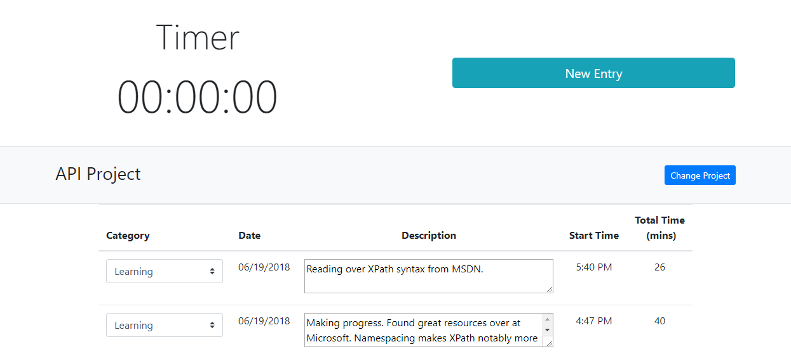

Recently, I squashed a bug that had been haunting my application for some time. This bug seemed to occur randomly, making it all the more difficult to resolve. After spending much time troubleshooting and patching (unsuccessfully), I finally got it and learned quite a lot along the way. I’m writing this to document my first foray into a hard to kill bug and 3rd party code (Vue).

# Background

This bug began several weeks ago. I had finished putting together my web application, which was comprised of Nodejs and Vue. Long story short, my application allows a user to create entries and log the time spent on them.


Because a picture is worth a thousand words.

The application is broken into a couple of major components. The relevant components here are the Timer and the Entries. When a user clicks on “New Entry”, a new row is generated in the entries table. The “New Entry” button would then be hidden and a new button would appear; “Log Entry”. Clicking on “Log Entry” would stop the timer and add the time to the latest entry.

Behind the scenes, there was a second Vue instance serving as an event bus for the Timer component where events could be emitted and listened on.
When "New Entry" was clicked, a 'startTimer' event would be emitted.  This would be received by the Entries component, which would kick a call to my Vuex store that would result in a new entry.

The issue I encountered was that sometimes multiple entries would be generated when “New Entry” was clicked.

# And so the hunt begins…

When I first encountered this issue, I didn’t quite know what to make of it. The issue appeared to occur randomly. I also noticed that reloading the application made the problem go away. At first, I felt like it might have been a timing issue. I reviewed my code and didn’t find anything that could cause this. So I started looking at the browser. Maybe, a click was somehow being triggered multiple times.

After a quick Google search, I found various results indicating that this could happen. Since I had nothing else to go on, I made a quick change to my code such that a click made on “New Entry” would trigger a flag. As long as the flag was there, all subsequent clicks would be ignored. The flag would be reset when the “Log Entry” button was clicked. If multiple clicks were somehow being generated, the flag should cause all other clicks made on “New Entry” to be ignored. I hoped this would be the end of it.

# The hunt continues...

I continued working on other parts of my application and occasionally tested it. The issue did not occur again at that time, so I thought the bug had been resolved. I finished up the Alpha version of the code and then pushed it into a new environment. It was here when the bug re-appeared!

Now, I thought, I’m a situation where a bug appears in one environment but not the other. Great… I started debugging the code more thoroughly. It was here where I noticed that the listener event to trigger a new entry was being called more than once. I deployed a small contingency of breakpoints and console log statements. After more careful testing, I concluded that multiple clicks was not the root cause of the issue. Something else was causing the event listener to trigger multiple times and I had no idea why.

# If at first you don't succeed...

At this point in time, I could only think of a couple of reasons why this was happening. Either there was something odd about the way I had written the code surrounding the event listener or there might have been a bug with Vue.

I decided to check out issues with Vue on Github, but could not find anything that would suggest this was their bug. I also noticed the promises I was using had catch statements, but no then statements. Maybe that was causing something odd to occur?

In order to confirm this, I added a then statement to the promise handling the emit event. The reason for not adding it was that I didn’t care much for confirmation of success, I only needed to know if there was an error message in this instance.
``` js
TimerBus.$on('startTimer', () => {
        this.$store.dispatch('newEntry')
            .then(console.log("Do Nothing"))
            .catch(err => {
                ErrorsBus.$emit("ErrorEvent", err)
            })
    })
```
I ran another test and….was still able to reproduce the issue. Something was causing the ‘startTimer’ event to fire multiple times and once again, I was short of the root cause.

# Deep into the maw of 3rd party code


By now, I had finally figured out how to reproduce this issue reliably. This issue only occurred when creating new projects. I decided to start looking at the Vue source code for clues.  This was accomplished by inserting breakpoints that handled the event listeners ($on).

This being my first time inside a major library’s source code was definitely challenging. Since Vue uses setters and getters inside objects, the debugger couldn’t always look inside of it. Whenever I tried to do so, the object would have functions, but the functions wouldn’t generate anything. It also didn’t help that this particular Vue file was about 10K lines.

As I debugged the issue, I paid more attention to the Vue instance being used as the event bus. After digging around I came across a property called _events. This one referenced the event listeners I had in my code. I knew I was getting closer to the root cause of the issue.

# The Encounter

After running more tests, I finally saw it. At last, I had come face to face with this beast. The _events object was registering duplicate $on events. But why? That would require additional investigation.

After some Google-Fu and reading over the Vue docs, I ran across $off. This removed registered event listeners and I knew
that was the solution. I added a $off before the entries component was destroyed and re-ran the tests. The issue didn't appear. I had slayed the bug.

But why did this happen? When a component is destroyed, doesn’t that remove any existing event listeners? We’ll as it turns out… it depends.

# Retrospective

This bug was a byproduct of how Vue works and incorrect assumptions on my part. When the router view/page is changed, the components on that page are destroyed and components on the new page are created. I assumed this would have also destroyed the event listeners.

In my case, creating a new project required going to a different page. This would destroy the Entries component. Once I had created the new project and gone back to the page with the Entries, this component would be recreated. This meant that new event listeners would get registered on the Vue instance  serving as an event bus for the Timer component.

Because the event bus was declared at a global level, the existing event listeners were not cleared out when the Entries component was destroyed. The more projects I created, the more duplicate event listeners where registered on the event bus.

When the 'startTimer' event was triggered, Vue would run through the _events and fire off all callbacks registered to
'startTimer' and that would cause the multiple entries to be generated. The only way to clear out event listeners registered by components inside a Vue instance on a different Vue instance was to do it manually using the $off option.

Just to be sure this was by design, I headed to the Vue Discord and asked a few questions. Namely, why weren't the event listeners on a separate Vue instance removed when a component was destroyed?

A very helpful member by the handle of Gusto explained this was likely by design. The reasoning for this behaviour is that although a Vue instance can be used as an event bus, this is not an official feature of Vue. Vue instances are not automatically aware of the state of other Vue instances.

Therefore, the Vue instance for the event bus has no built-in way of detecting when a component on another Vue instance has been destroyed. This is something that has to be done manually.

# Lessons Learned

## Take the Time to Find Root Cause
One of the missteps I made was not being patient enough to find out the root cause of the issue. If I would have taken the time to find the root cause, I would have solved this issue sooner.

## Deeper understanding of Vue
Part of this excursion was that I improved my understanding of Vue, at least on how it related to event listeners.

## Event buses and the $off method
I learned to use the $off when registering event listeners across Vue instances.